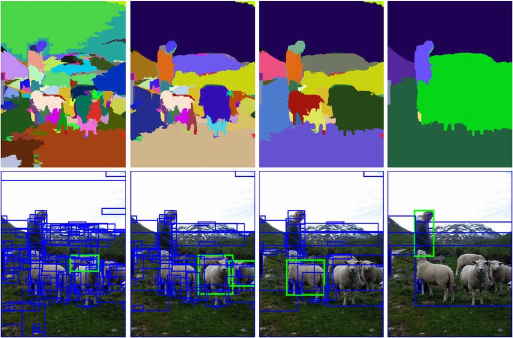

# Logo Detection
A brand logo detection system using Selective Search for Object Detection with R-CNN.

Don't forgot to check out the demo video below.

# Demo Video
https://user-images.githubusercontent.com/80465899/127872153-f328c9e0-b408-4b6a-af97-8696e7647039.mp4

# Datasets Used
1 -> Flickr_logos_27

2 -> Flickr_logos_32

3 -> Flickr_logos_47

# Requirements

- numpy
- pandas
- pillow
- pickle
- tensorflow
- keras
- selective search
- flask
- flask_ngrok

# Architecture used
Inception Resnet V2

# Process

Step 1 - Collect all the brand images from three datasets.

Step 2 - Preprocess the data.

Step 3 - Train the model using inception resnet v2 architecture.

Step 4 - Save the trained model

Step 5 - Import Selective Search

Step 6 - Perform selective search on input image.

Step 7 - Finally predict the regions with our trained model.

Step 8 - Above relies on object detection + image classification.

# Selective search approach

The selective search paper considers four types of similarity when combining the initial small segmentation into larger ones. 
These similarities are: 

1 - Color Similarity

2 - Texture Similarity

3 - Size Similarity

4 - Fill Similarity

# Things to improve
Selective Search is widely used in early state-of-the-art architecture such as R-CNN, Fast R-CNN etc. However, Due to number of windows it processed, it takes anywhere from 1.8 to 3.7 seconds (Selective Search Fast) to generate region proposal which is not good enough for a real-time object detection system. So, consider using YOLO, SSD, Faster RCNN for better perfommance & more accurate and fast in real-time object detection system.

